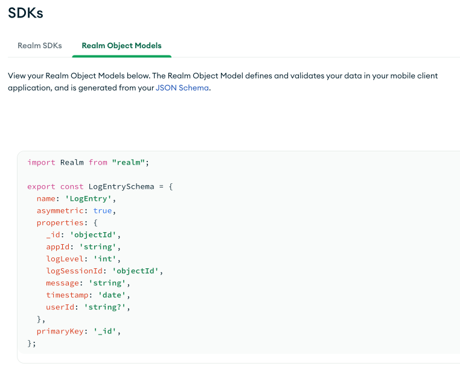

## RemoteLogger for Realm Clients

### Abstract

While developing and maintaining a [MongoDB Realm](https://www.mongodb.com/docs/realm/) application, sometimes there's the need to collect and analyse the client logs. This is straightforward during the development phase, but could be difficult when the app is out to testers, or there are issues with final users that are not easily reproducible, especially on mobile devices that may not be readily available.

The `RemoteLogger` class in this repository aims to ease this process, by collecting the client logs and transmitting them to an online database, where they can be analysed for issues without accessing the users' devices. The class tries to be as simple and non-intrusive as possible, limiting its setup in the client's code to 3 lines, that makes it easy for the developer to switch it on and off on demand.

At this time, the following Realm SDKs are supported:

- Realm JS SDK (all variants - Node.js, React Native and Electron)

### Setup

In order for the log collection to have as little footprint on the observed app as possible, it is advised to set up a separate Realm App with that specific purpose, that can be deployed on the same cluster, or a completely separate one. Please be aware, though, that logs can be very storage-intensive, especially at level `trace` or `all`, so it's important to ensure that enough disk space is available for the collection that will hold the relevant data.

#### Steps

- Create a new Realm App, on the desired Cluster: here it's been named **RemoteLogging**, but any valid name will do. Take note of the App ID, as it's needed later in the client app's code.


- Select the new App, and go to the Schema screen: from the Data Source row required to hold the data (usually called `mongodb-atlas`), click the three dots menu and select **Add Collection**


- Create a new Database, and a new Collection: here, they're called `logging` and `log_entries` respectively. While the names can be different, it's recommended they stay the same, as future developments may rely on these names.


- In the resulting entry for the collection, generate a schema and paste the following (remember to save and deploy at all steps, to avoid missing pieces later):

```json
{
  "title": "LogEntry",
  "bsonType": "object",
  "required": [
    "_id",
    "logSessionId",
    "appId",
    "timestamp",
    "logLevel",
    "message"
  ],
  "properties": {
    "_id": {
      "bsonType": "objectId"
    },
    "logSessionId": {
      "bsonType": "objectId"
    },
    "appId": {
      "bsonType": "string"
    },
    "timestamp": {
      "bsonType": "date"
    },
    "logLevel": {
      "bsonType": "long"
    },
    "message": {
      "bsonType": "string"
    },
    "userId": {
      "bsonType": "string"
    }
  }
}
```

- _(Optional, but suggested for future developments)_ From the Cluster panel, choose **Browse Collections**, and select the database and collection just created. Click the **Indexes** tab, and the **Create Index** button


- Back in the App, select the **DeviceSync** screen, and enable **Flexible Sync**: there isn't the need to define any queryable fields at this time, as the class will only push data to the backend, and doesn't need to read it back. Expand the **Advanced Configuration** panel, and from the **Asymmetric Sync** menu select our `LogEntry` class


- Select the **Authentication** screen, and the **API Keys** provider: enable it, and **Create API Key**. This will be needed later in the app, so keep it around


- Save and deploy everything one last time: the app should now be ready to receive data from the clients. To double-check that everything went smoothly, select the **Realm SDK** screen, and the **Realm Object Models** tab, and you should find the native structure that will be used in the app (here the JS model is shown)



### Usage

- Somewhere in your code, put the following snippet (this is Javascript, adapt for your language of choice)

```js
const { RemoteLogger } = require('./RemoteLogger');
…
const remoteLogger = new RemoteLogger('<logger app ID>', '<API Key>');
```

- Then, as soon as the observed app is created, add the following line (**NOTE** This can only be called **once** per every startup)

```js
    await remoteLogger.startLogging(app, '<log level>');
```

- This will start sending all the log messages to the app set up in the backend: when you're done with the application, a good practice to ensure that everything has been recorded is to call the following

```js
    await remoteLogger.stopLogging();
```

### Where to go from here

There's a sample application in the repository that shows the above by accessing a Flexible Sync Realm app that can be observed: to launch it, pass the relevant parameters in, for example as follows:

```
node ./index.js --appId='<observed App ID>' --user='<email>' --password='<password>'
```

If the user has access to any data, and everything went well, the sample code will print a few messages, and the `logging.log_entries` collection on the backend will contain the lines of the log.

At this time, that content can be filtered, for example, by `logSessionId`, for simple browsing and/or exporting to, say, CSV, to diagnose issues happening to the client.

Future developments will include tools that can facilitate that kind of analysis.

#### Disclaimer

The source code provided here is published in good faith and for general information purpose only. The author(s) and MongoDB Technical Support don't make any warranties about the completeness, reliability and accuracy of this information. Any action you take upon the provided code, and its use in conjunction with other code and libraries, is strictly at your own risk. The author(s) and MongoDB Technical Support will not be liable for any losses and/or damages in connection with the use of this code.
